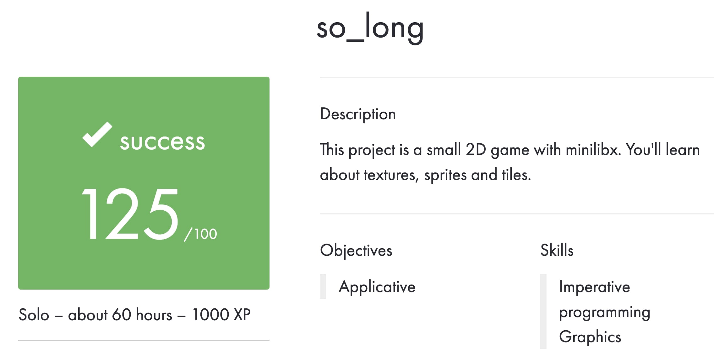
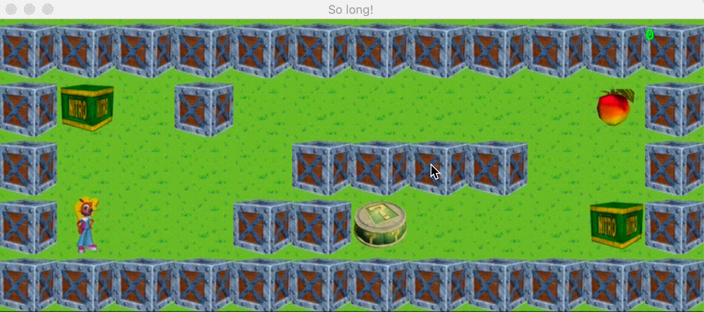

# So_Long

Subject is in the file en.subject.pdf.

The project uses personal [library](https://github.com/Anastsiia/libft) and [function](https://github.com/Anastsiia/get-next-line) implemented in previous projects
All the visualization is done with the help of the [MiniLibX](https://github.com/42Paris/minilibx-linux) library.

P.S. These are school projects, they were limited by certain conditions and rules for writing code. Therefore, do not be surprised that everything is output through write or the while loop is used everywhere, etc. =)

